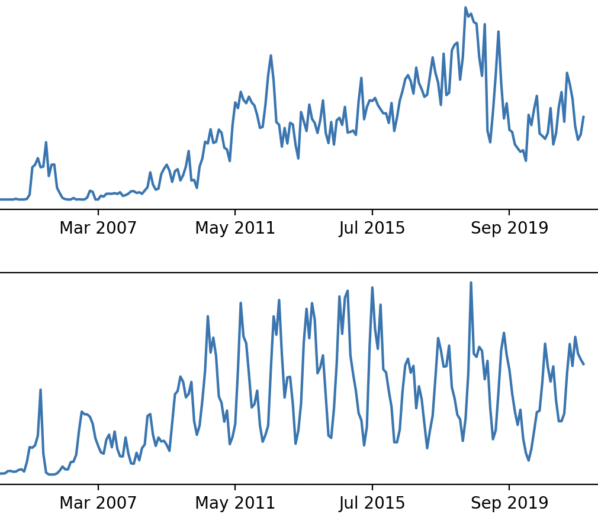

# Creating-time-series-from-Chinese-trade-data

This data reports on the volume, value, unit value, and import market share of certain textile and apparel imports from China for Q4 of the 2021 financial year. Products are coded in what are called 'HTS codes',  a classification system used in the United States to help determine customs duties to be paid on imports. Using Python Pandas in Jupyter notebook, I isolate time series data for the values in dollars per unit of the following products:  Woven Fabrics Of Synthetic Filament Yarn and Womens Trousers & Breeches.  I created time series subplots using Matplotlib after filtering for the desired data. 

My visualization suggested that the total import dollar value of Womens Trousers And Breeches exhibited seasonality than the the value of raw material. This makes verifiable sense, as trousers and breeches are things that may only be bought in one season of the year. 

The public data can be found here: https://catalog.data.gov/dataset/textile-and-apparel-imports-from-china-statistical-reports-fourth-quarter-2021
